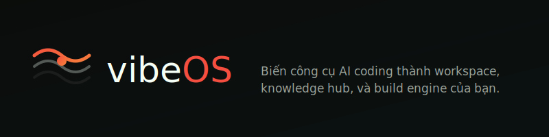
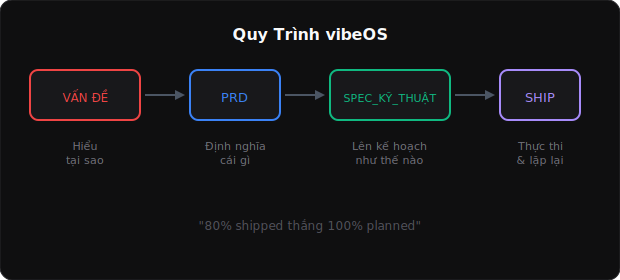
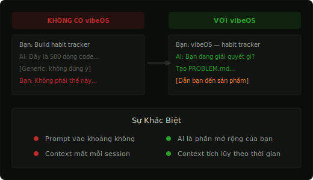

<p align="right">
  <a href="README.md">English</a> •
  <strong>Tiếng Việt</strong>
</p>

<p align="center">
  
</p>

> Biến công cụ AI coding thành workspace, knowledge hub, và build engine của bạn.

---

## Lưu Ý

**Đây không phải chân lý. Đây không phải giải pháp hoàn hảo.**

vibeOS chỉ đơn giản là một cách làm việc hiệu quả — một hướng dẫn và sự thay đổi tư duy, không phải quy tắc cứng nhắc.

Những niềm tin cốt lõi trong `.os/SYSTEM.md` và `.os/MANIFESTO.md` có thể phù hợp với bạn, hoặc không. Không sao cả. **Lấy những gì phù hợp. Bỏ qua những gì không. Biến nó thành của bạn.**

Bạn sẽ tự tìm ra cách sử dụng framework này hiệu quả qua thực hành. Framework thích ứng với bạn, không phải ngược lại.

---

## Ai Sử Dụng vibeOS

| Vai Trò | Cách Sử Dụng |
|---------|--------------|
| **Product Managers / Product Owners** | Spec tính năng, viết PRD, align với engineering |
| **Engineers (Junior → Senior)** | Build app, thiết kế hệ thống, ship nhanh hơn |
| **UI/UX Designers** | Design system, prototype, handoff cho dev |
| **Marketing** | Lên kế hoạch campaign, tạo content, nghiên cứu |
| **Business Analysts / Data Analysts** | Phân tích dữ liệu, nghiên cứu, báo cáo |

Framework tự động nhận diện ý định của bạn và thích ứng — bạn không cần phải là dân technical.

---

## Vấn Đề

Hầu hết mọi người gặp khó khăn với AI coding tools:

- **Workspace lộn xộn** — file ở khắp nơi, không có cấu trúc
- **Context rời rạc** — AI quên hết mọi thứ giữa các session
- **Không có tư duy hệ thống** — nhảy thẳng vào giải pháp mà không hiểu vấn đề
- **Prompt paralysis** — không biết cách plan và iterate với AI
- **Không ship được** — stuck trong vòng lặp, không bao giờ hoàn thành

Bạn có công cụ AI mạnh mẽ. Nhưng không có hệ thống, bạn chỉ đang prompt vào khoảng không.

---

## Giải Pháp

vibeOS là **framework** giúp AI hoạt động như một phần mở rộng của BẠN:

<p align="center">
  
</p>

**Thay đổi:**
- Workspace luôn gọn gàng (projects/, templates, handoffs)
- Context được giữ qua các session (NOTES.md, handoff logs)
- AI suy nghĩ như bạn (IDENTITY.md, principles của bạn)
- Đường đi rõ ràng từ ý tưởng đến sản phẩm hoàn thành

---

## Trước / Sau

<p align="center">
  
</p>

---

## Tương Thích Với

| Công Cụ | Trạng Thái |
|---------|------------|
| Claude Code | ✓ Tự động đọc CLAUDE.md |
| Cursor | ✓ Tự động đọc AGENTS.md |
| Windsurf | ✓ Đọc context files |
| Cline | ✓ Đọc context files |
| Bất kỳ AI nào đọc files | ✓ Chỉ cần trỏ đến AGENTS.md |

---

## Bắt Đầu Nhanh (2 phút)

```bash
# Clone vibeOS
git clone https://github.com/kv0906/vibeos.git
cd vibeos

# Mở với AI editor của bạn
cursor .     # hoặc windsurf . hoặc claude

# Bắt đầu build
# Chỉ cần nói: "vibeOS — Tôi muốn build [ý tưởng của bạn]"
```

AI sẽ hướng dẫn bạn từ đó.

Xem [QUICKSTART.md](QUICKSTART.md) để setup đầy đủ.

---

## Cách Hoạt Động

### 1. Bạn nói điều bạn muốn
```
"Tôi muốn build landing page"
"Tôi muốn research giá đối thủ"
"Tôi muốn viết blog post về AI"
```

### 2. AI nhận diện loại project

| Loại | Là gì | Flow |
|------|-------|------|
| **Build** | Software, app, website | PROBLEM → PRD → TECH_SPEC → Ship |
| **Research** | Phân tích, docs, học hỏi | PROBLEM → NOTES |
| **Create** | Content, viết lách, design | PROBLEM → NOTES |

### 3. AI hướng dẫn bạn từng bước

- Hỏi đúng câu hỏi
- Tạo đúng files
- Giữ context qua các session
- Giúp bạn ship, không chỉ code

---

## Cấu Trúc

```
vibeos/
├── .os/                        ← Hệ điều hành
│   ├── SYSTEM.md               ← Niềm tin & nguyên tắc cốt lõi
│   ├── MANIFESTO.md            ← Cách AI hoạt động
│   ├── WORKFLOW.md             ← Vòng đời project
│   └── IDENTITY.template.md    ← Phong cách cá nhân (copy file này)
│
├── roles/                      ← Các chế độ kỹ năng
│   ├── ENGINEER.md             ← Build software
│   ├── PRODUCT_OWNER.md        ← Định nghĩa products
│   └── templates/              ← Thêm roles khác
│
└── examples/                   ← Hành trình project thực tế
    ├── build-habit-tracker/    ← Ví dụ Build đầy đủ
    └── research-user-behavior/ ← Ví dụ Research
```

---

## Dành Cho Ai

- **Solo builders** ship với AI
- **Product engineers** sở hữu từ problem → code → ship
- **Bất kỳ ai mệt mỏi với prompts rời rạc** muốn có hệ thống thực sự

## KHÔNG Dành Cho

- Team enterprise lớn cần governance
- Người mới bắt đầu cần học fundamentals trước
- Người tìm kiếm magic prompts

---

## Nguyên Tắc Cốt Lõi

Từ [SYSTEM.md](.os/SYSTEM.md):

1. **Problem-first** — Hiểu trước khi build
2. **Simplicity** — Nén complexity, ship sạch sẽ
3. **Systems over goals** — Xây dựng quy trình lặp lại được
4. **Ship and iterate** — 80% shipped thắng 100% planned

---

## Ví Dụ

Xem hành trình project thực tế trong [examples/](examples/):

- **[build-habit-tracker](examples/build-habit-tracker/)** — Project Build đầy đủ: ý tưởng → app hoàn thành
- **[research-user-behavior](examples/research-user-behavior/)** — Project Research: câu hỏi → insights

---

## Tùy Chỉnh

vibeOS được thiết kế để fork và tùy chỉnh:

- **`.os/SYSTEM.md`** — Sửa nguyên tắc theo niềm tin của bạn
- **`.os/IDENTITY.md`** — Thêm giọng văn và phong cách cá nhân
- **`.os/MANIFESTO.md`** — Điều chỉnh cách AI hoạt động
- **`roles/`** — Tạo custom roles cho workflow của bạn

Phiên bản tốt nhất của vibeOS là phiên bản bạn tự tạo ra.

---

*Suy nghĩ sâu. Build đơn giản. Để hệ thống gánh phần nặng.*
